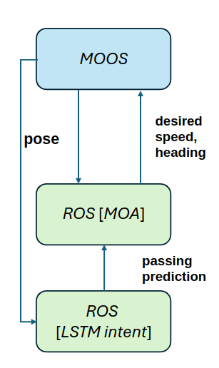

# moos-ros-bridge

A communication bridge between the MOOS and ROS publish-and-subscribe
middleware systems.

If you use the moos-ros-bridge in your research, please cite our research
paper:

    @inproceedings{demarco2011implementation,
        title={An implementation of ROS on the Yellowfin autonomous underwater vehicle (AUV)},
        author={DeMarco, Kevin and West, Michael E and Collins, Thomas R},
        booktitle={OCEANS 2011},
        pages={1--7},
        year={2011},
        organization={IEEE}
    }

## Build Instructions

### Install Dependencies

First, install MOOS as normal. Then, install some extra dependencies from your
package manager:

    $ sudo apt-get install librapidxml-dev

## Build in a catkin workspace

1. Setup a ROS catkin workspace, if you don't have one already:

        $ source /opt/ros/kinetic/setup.sh
        $ mkdir -p ~/catkin_ws/src && cd ~/catkin_ws/
        $ catkin_make

2. Clone this repo into into `~/catkin_ws/src`:

        $ cd ~/catkin_ws/src
        $ git clone https://github.com/SyllogismRXS/moos-ros-bridge.git

3. Build it:

        $ cd ~/catkin_ws
        $ catkin_make
        $ source ./devel/setup.sh

# Run an Example

Start the MOOS Database

    $ MOOSDB

In a different terminal, run a launch file that will start the "Bridge" ROS
node as well as a ROS node that increments a counter in the ROS topic,
"CounterFromROS," with data type, `std_msgs::Int32`. Note that the Bridge ROS
node requires both a `.moos` file (`bridge.moos`), so that it can connect to
the appropriate MOOS database, and an XML file (`counters.xml`), so that the
Bridge can translate between ROS and MOOS data types.

    $ roslaunch moos-ros-bridge counter.launch

In a new terminal, use `uMS` to observe the "CounterFromROS" topic being
updated in MOOS:

    $ uMS

Make sure HostName is `LOCALHOST` and Port is `9000`. Click on "Connect." You
should see the CounterFromROS variable incrementing.

At this point, the Bridge is also looking for changes in the "CounterFromMOOS"
variable in the MOOS community. Let's monitor the variable in ROS as we change
it using uMS. Open a new terminal and run the `rostopic echo` command:

    $ rostopic echo /CounterFromMOOS

In the uMS window, CTRL+RightClick on an empty row. Enter the variable name:
CounterFromMOOS. Choose NUMERIC. Enter value: 42. You should see the rostopic
echo program print out the following:

    data: 42

---


## Run an Example from a Script

Read through the bash script at `moos-ros-bridge/scripts/counter.sh` for an
example of how to start both the Bridge ROS node and MOOS within the same
script. Run the script:

    $ rosrun moos-ros-bridge counter.sh

    # Type CTRL+c to exit

## Bridge Configuration

The Bridge is configured using an XML file that specifies the names of ROS and
MOOS topics and the associated data types. Look at
`moos-ros-bridge/config/counters.xml` and
`moos-ros-bridge/config/moosrosconfig.xml` for examples. In the XML file, each
message consists of the following members:

`moosname` - the name of the moos variable

`rosname` - the name of the ros topic

`moostype` - the type of the moos variable

`rostype` - the type of the ros topic

`direction` - the direction of the data over the bridge (either toMOOS or toROS).

## MOA connection


Do the following procedure because it does not work properly if Docker runs first and eats port number.

1. MOOS
Note that 2, 4, 6 (1,3,5 obstacles) can be launched in the folder m2, m4, m6_berta.
```
cd ~/moos-ivp/ivp/missions/m2_berta
./launch.sh
```
2. MOOS-ROS wrapper
Depending on the number of total robots, 
```
roslaunch moos-ros-bridge robots_two.launch
```

3. MOA
```
xhost +local:docker
cd ~/vnc-ros/
docker-compose up -d
docker compose exec ros bash
roslaunch obstacle_avoidance_ros_pkg master_controller.launch obstacle_total:=1 case:=1 open_rviz:=true master_visualization:=true avoidance_algo:=MOA open_stage:=false obstacle_control:=false adaptive_avoidance:=true use_logging:=false moos:=true
```

* Key components:
    * MOOS-wrapper only supports Int, Float, String. Hence, we are limited to using custom messages. 
    * Python publisehd topic was not working properly. Hence, twistToMOOS.cpp handles subscription of python published controlled command and re-publish again in C++. This enables moos wrapper can relay the control signal to MOOS.
    * MOOS-ROS communication runs in a fixed frequency. 1Hz. Hence, the control signal from MOA and pose input to MOA is not fast -- limitation I can mention.